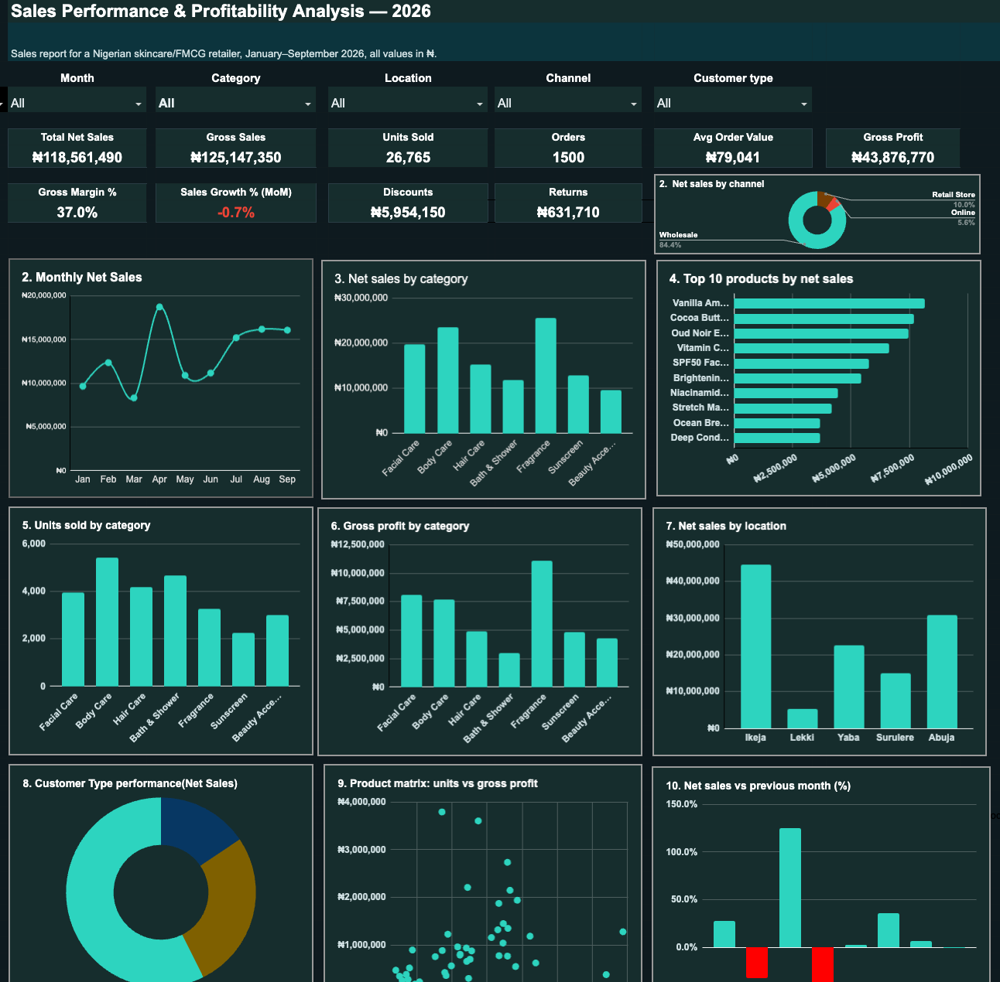
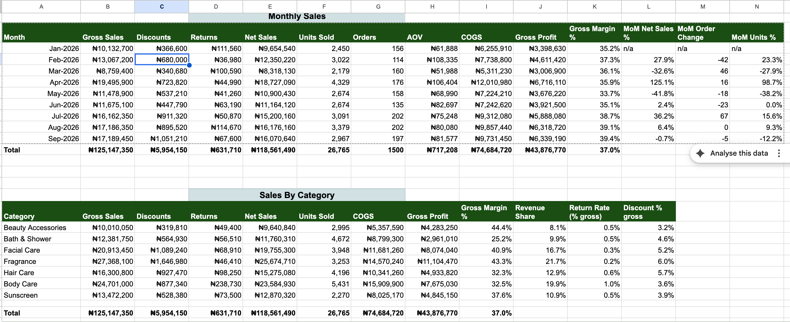

# Sales Performance & Customer Analytics Dashboard
This project analyzes sales performance, customer behavior, product performance, sales channels, and location-level performance for a beauty and personal-care business.



<p align="center">
  <strong>Turning raw sales data into clear business insights and actionable decisions.</strong>
</p>

<p align="center">
  
  
  
  
</p>

---

##  Project Overview
The goal was to transform raw transactional data into a structured analytical workbook and management dashboard that provides clear insights for business decision-making.

The project follows the complete data analysis process:

**Raw Data → Data Cleaning → Data Validation → Analysis → KPI Calculation → Dashboard → Business Insights**

---

##  Business Questions

The analysis was designed to answer questions such as:

- How is overall sales performance?
- Which months generated the highest and lowest sales?
- Which products generate the most revenue?
- Which product categories perform best?
- Which sales channels contribute the most revenue?
- Which locations perform best?
- Which customer types generate the most revenue?
- Which customers are the most valuable?
- Where are discounts and returns highest?
- What actions can management take based on the findings?

---

# Dashboard

The dashboard provides a management-level overview of business performance.

### Dashboard Features

- KPI cards
- Monthly sales analysis
- Product performance
- Category performance
- Customer analysis
- Customer type analysis
- Sales channel analysis
- Location analysis
- Gross profit analysis
- Gross margin analysis
- Discounts
- Returns
- Interactive filters

---

# Key Performance Indicators

| KPI | Result |
|---|---:|
|  Gross Sales | ₦125.15M |
|  Net Sales | ₦118.56M |
|  Units Sold | 26,765 |
|  Orders | 1,500 |
|  COGS | ₦74.68M |
|  Gross Profit | ₦43.88M |
|  Gross Margin | 37.0% |
|  Discounts | ₦5.95M |
|  Returns | ₦631.71K |

---

#  Key Insights

## 1. Sales Performance

Net sales reached approximately **₦118.56M** during the period analyzed.

April recorded the strongest monthly net sales at approximately **₦18.73M**, while March recorded the lowest at approximately **₦8.32M**.

The dashboard makes it possible to compare monthly performance and identify periods of strong and weak sales.

---

## 2. Product Category Performance

**Fragrance** was the highest-performing category by net sales, generating approximately **₦25.67M**.

The strongest categories included:

| Category | Net Sales |
|---|---:|
| Fragrance | ₦25.67M |
| Body Care | ₦23.58M |
| Facial Care | ₦19.76M |
| Hair Care | ₦15.28M |
| Sunscreen | ₦12.87M |

Fragrance also recorded a gross margin of approximately **43.3%**.

---

## 3. Top Product

The highest-performing product by net sales was:

### Vanilla Amber Perfume 100ml

| Metric | Result |
|---|---:|
| Net Sales | ₦8.15M |
| Units Sold | 686 |
| Gross Profit | ₦3.60M |
| Gross Margin | 44.2% |

This demonstrates why product-level analysis is important when identifying major revenue and profit drivers.

---

# Sales Channel Analysis

Wholesale was the dominant sales channel.

| Channel | Net Sales | Share |
|---|---:|---:|
| Wholesale | ₦100.11M | 84.4% |
| Retail Store | ₦11.85M | 10.0% |
| Online | ₦6.60M | 5.6% |

### Insight

Wholesale generated the majority of revenue.

However, Retail Store and Online channels provide opportunities for the business to diversify revenue and potentially increase direct-to-consumer sales.

---

# Customer Analysis

Customer analysis was used to understand revenue contribution across different customer types.

| Customer Type | Net Sales |
|---|---:|
| Distributor | ₦68.00M |
| Wholesale | ₦32.11M |
| Retail | ₦18.45M |

### Insight

Distributors generated the largest share of revenue.

This highlights the importance of managing high-value customer relationships while also monitoring customer concentration risk.

---

# Location Analysis

Location analysis was used to compare sales performance across different business locations.

Ikeja generated the highest net sales at approximately **₦44.59M**, followed by Abuja at approximately **₦30.91M**.

Surulere recorded strong growth between the periods analyzed, increasing by approximately **125.6%**.

---

# Discounts & Returns

The analysis also examined discounts and product returns.

### Discounts

Total discounts were approximately **₦5.95M**.

Fragrance recorded the highest discount value at approximately **₦1.65M**.

### Returns

Total returns were approximately **₦631.71K**.

Body Care recorded the highest return value at approximately **₦238.73K**.

These metrics can help management evaluate pricing, promotional activities, product quality, and customer experience.

---

# Data Cleaning & Preparation

Before analysis, the dataset was prepared and validated to improve consistency and reliability.

The process included:

- Date validation
- Missing value checks
- SKU validation
- Product validation
- Category consistency checks
- Customer data preparation
- Data type corrections
- Calculation of derived metrics
- Validation of sales and financial fields

### Data Flow


```text
Raw Data
    ↓
Data Cleaning
    ↓
Data Validation
    ↓
Cleaned Data
    ↓
Calculations
    ↓
Analysis
    ↓
KPIs
    ↓
Dashboard
    ↓
Business Insights
```

## Data Cleaning & Preparation

Based on the analysis, management could:

- Continue monitoring Fragrance and Body Care because of their strong revenue contribution.
- Review the profitability of high-volume products with lower margins.
- Explore ways to increase Online and Retail Store sales.
- Monitor discounts closely, particularly within Fragrance.
- Investigate the higher return rate within Body Care.
- Maintain strong relationships with high-value distributor customers.
- Monitor customer concentration and dependency on a small number of large customers.
- Use product-level profitability rather than sales volume alone when making inventory and marketing decisions.

## What I Learned

This project strengthened my ability to move from raw data to business recommendations.

Key areas I practiced include:

- Cleaning and structuring messy sales data
- Building reusable Excel calculations
- Creating business KPIs
- Using lookup and conditional aggregation formulas
- Analyzing sales trends
- Comparing customer segments
- Measuring product profitability
- Building management dashboards
- Translating numbers into actionable business recommendations

# About Me

Funke Bolarin

Inventory Control Professional & Data Analyst in Training

I have a background in inventory control, logistics, FMCG, and retail operations, and I am transitioning into data analytics.

My analytics toolkit includes:

Excel | Google Sheets | SQL | Power BI | Data Cleaning | Data Analysis | Dashboard Development

I enjoy using data to solve practical business problems, particularly in inventory, sales, operations, and supply chain environments.

Connect With Me
LinkedIn:[Linkedin](https://www.linkedin.com/in/funkebolarinval/?isSelfProfile=true)
GitHub:[ Funke-B](https://funke-b.github.io/Funke-Val-B.github.io/)
⭐ Project Status


Completed

